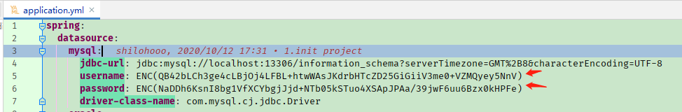
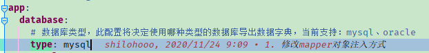
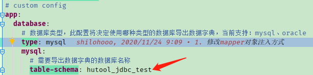
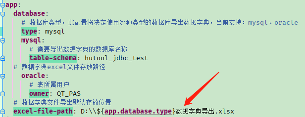
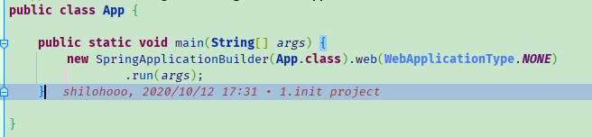
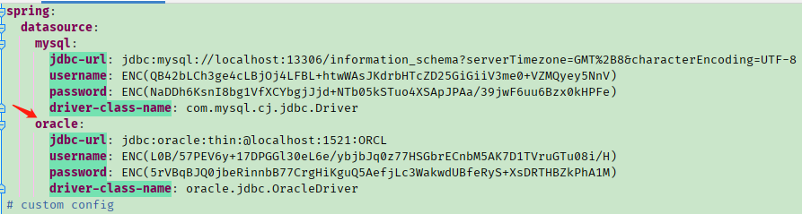
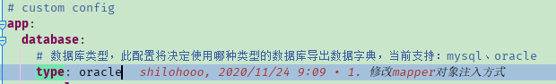
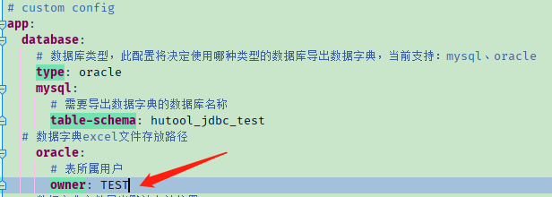

# data-dict-build-tool
数据库数据字典生成工具，支持mysql和oracle的数据字典导出

## 使用方法

### MySQL

1. 修改配置文件中的MySQL数据库连接信息：用户名和密码

说明，数据库帐号密码采用jasypt加密，参考资料：https://github.com/ulisesbocchio/jasypt-spring-boot

2. 修改导出数据字典的数据库类型为MySQL

3. 修改导出数据字典的数据库名称

4. 修改数据字典导出位置，默认在D盘

5. 运行程序

   

----

### Oracle

1. 修改配置文件中的Oracle数据库连接信息

说明：驱动程序包请自行准备

2. 修改导出数据字典的数据库类型为oracle

   

3. 修改Oracle数据库表空间所属用户

4. 修改数据字典导出位置，默认在D盘

5. 运行程序

